# Bootstrap Assignment-2

## Description

Convert the image into a Bootstrap website. : [Link text Here](https://www.figma.com/file/4RtNAm6HyddK1KyiltQxzX/HTML%2FCSS%2FBootstrap-Assignment?node-id=0%3A1)

Note: 

a) Only use Bootstrap classes for creating container, row, column, forms, and tables.

b) Page should be responsive to all screen sizes

c)  Minimum use of custom CSS to be made,

d) The web page should look the same as per the image. Check different bootstrap components and see which one fits better. Be sure that spacing between components is also proper and it looks as a decent web page.

e) This activity will be evaluated on various pointers like Code readability, indentation and formatting, proper naming conventions for classes, proper use of bootstrap. 

### Screenshots

> 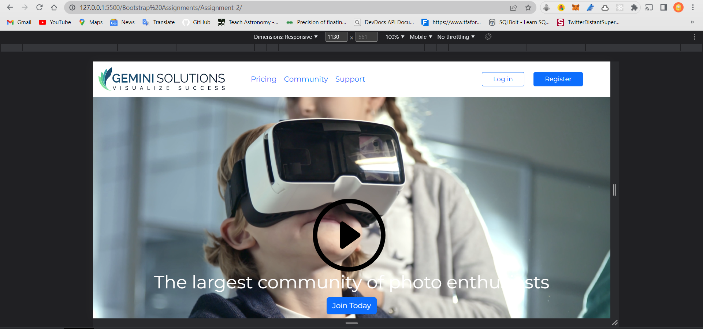
* Functional Play and Pause Button using javascript
> 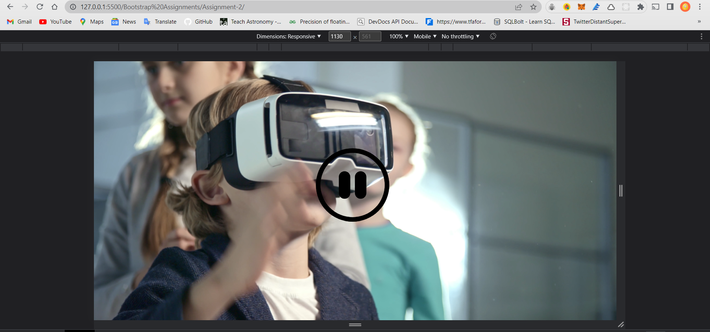
> 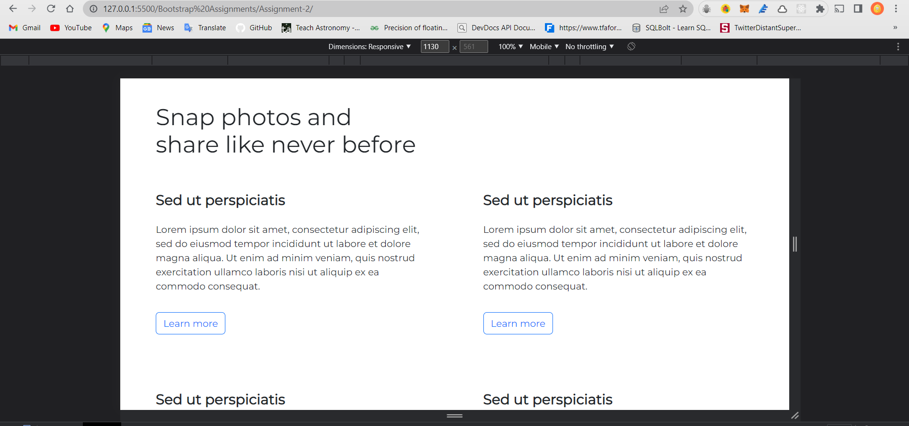
> 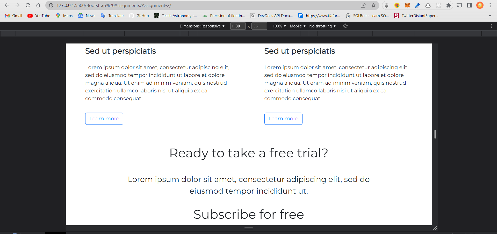
> 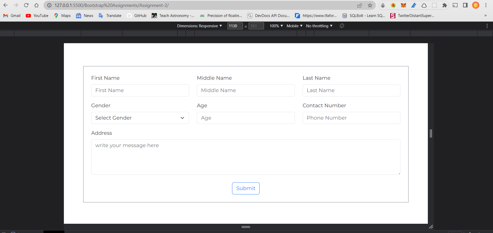
> 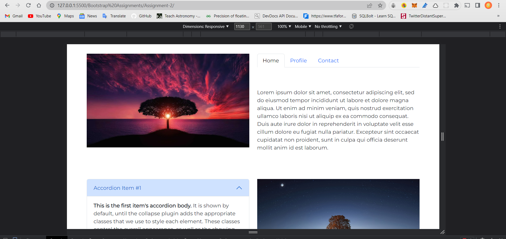
> 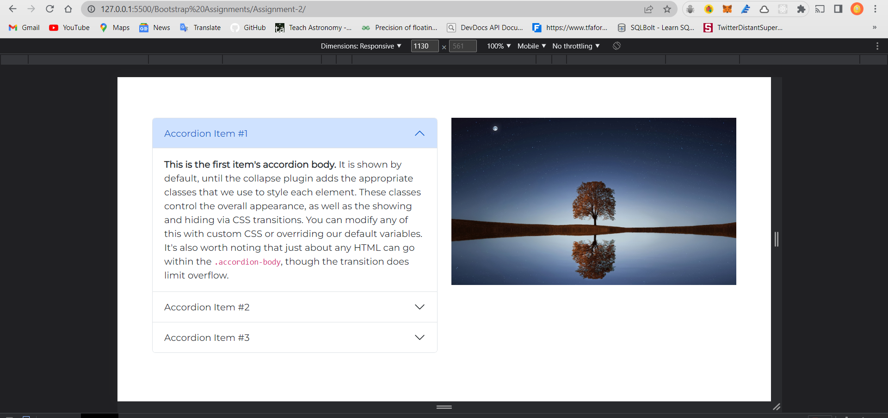
> 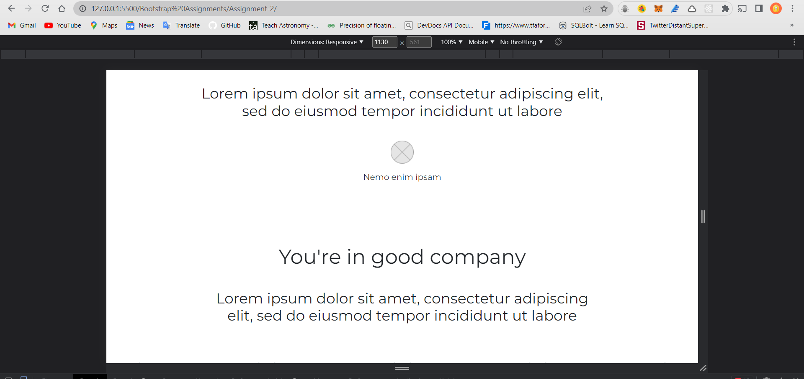
> 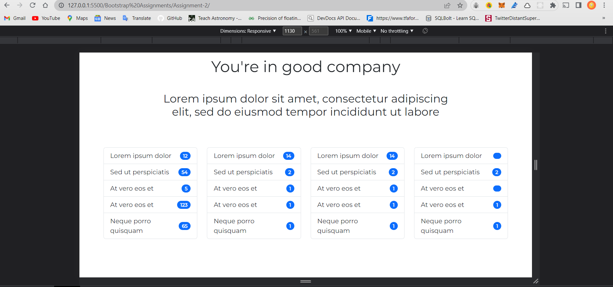
> 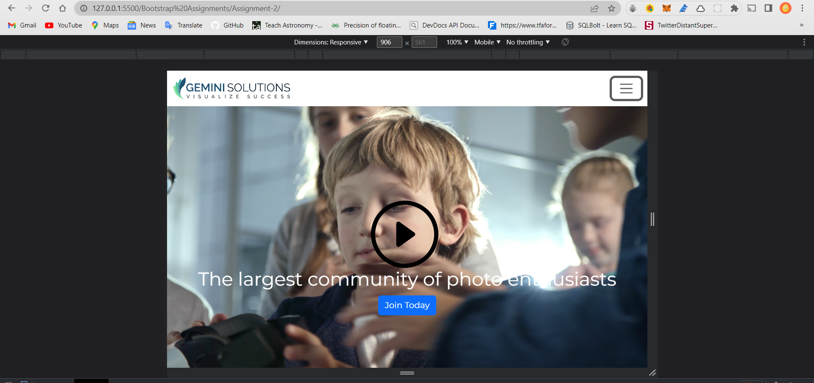
> 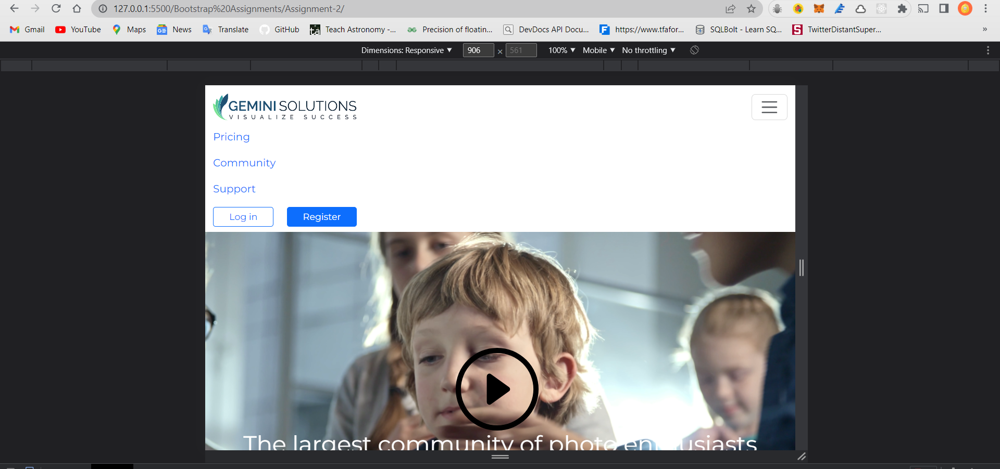
