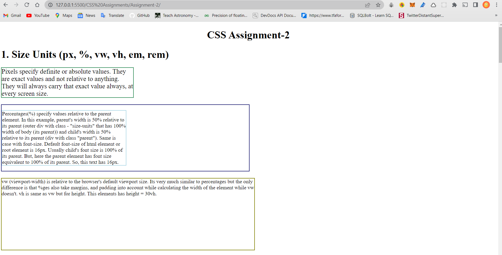
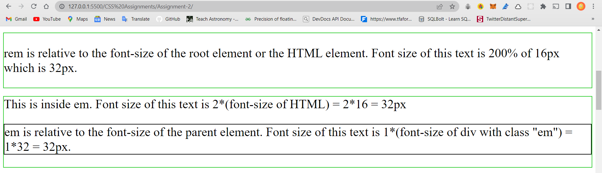
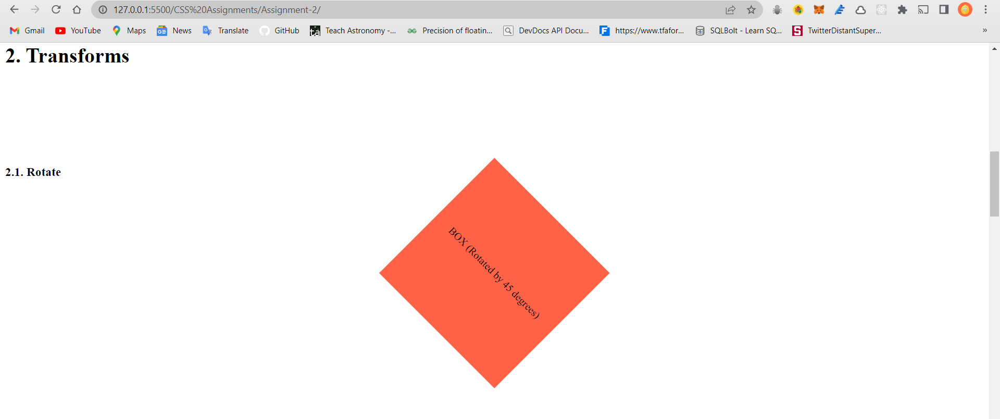
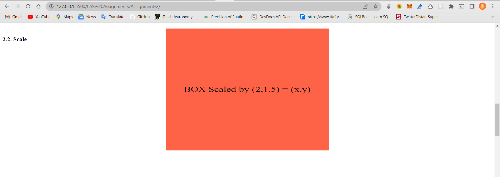
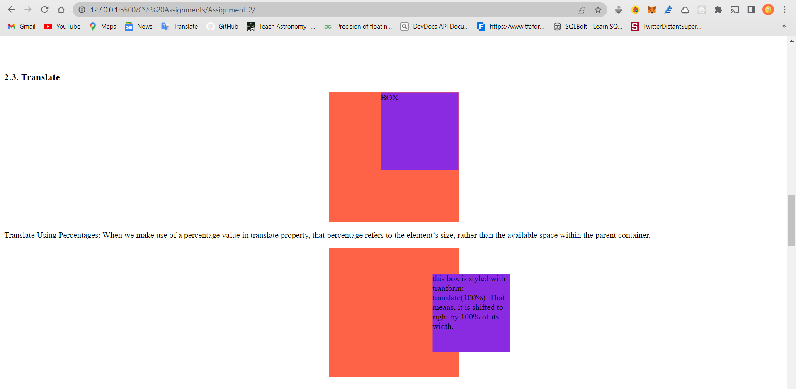
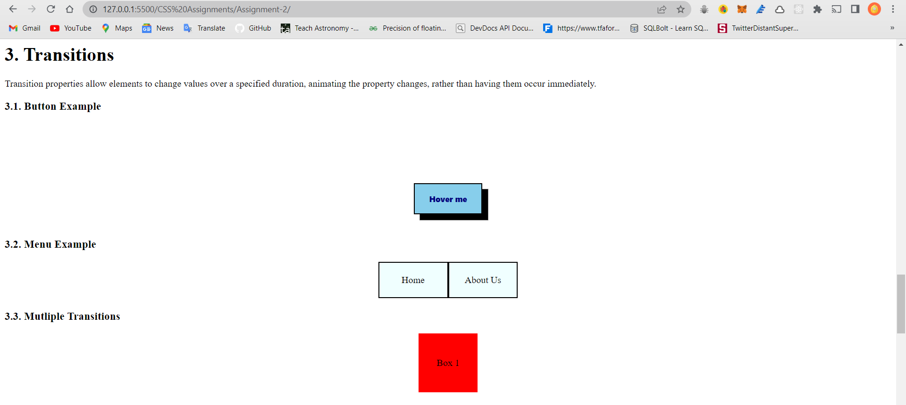
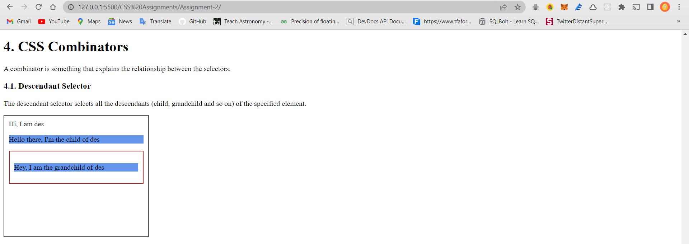
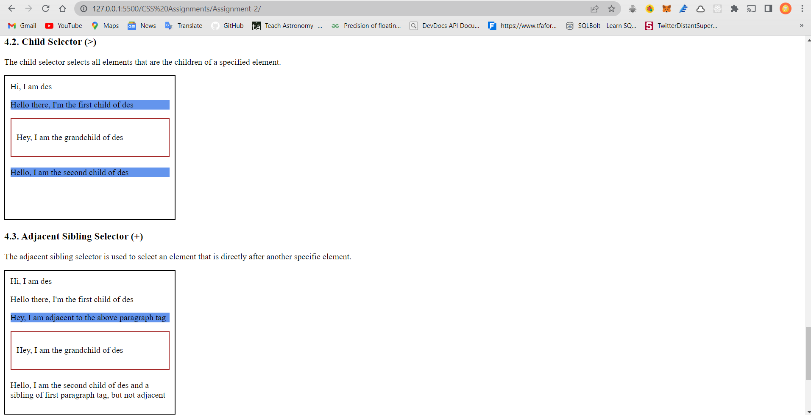
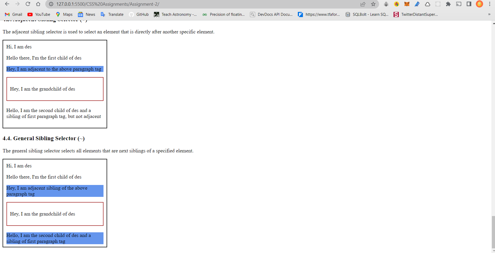

# CSS Assignment-2

## Description

1. Demo specifying the difference between rem,em,vh,vw,px.

2. Reduce css code using CSS chaining concept.

3. Demo specifying difference between css combinators (>,+,~)

4. Create a demo for css transition and transform.

### Screenshots

> 
> 
> 
> 
> 
> 
> 
> 
> 