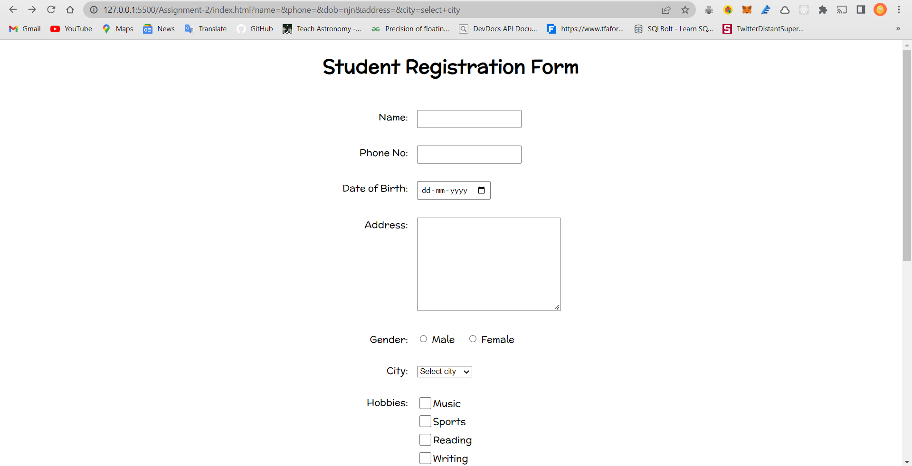
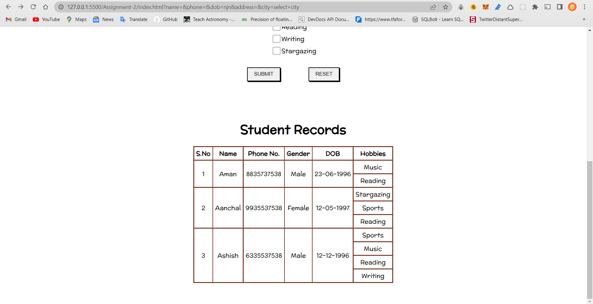

# HTML Assignment-1

## Description

* Design and create a webpage with HTML form and a table. It must include the following :

1. Name
2. Phone number
3. Date of birth
4. Address
5. Gender
6. City - dropdown
7. Hobbies - checkbox
8. Submit button  - to submit form
9. Reset button - to reset form
10. A static table to display 3 records - columns (SNo, Name, Phone no, Gender, City, Hobbies(hobbies will span over multiple rows))
11. All form elements must only allow valid input.

### Screenshots

> 
> 